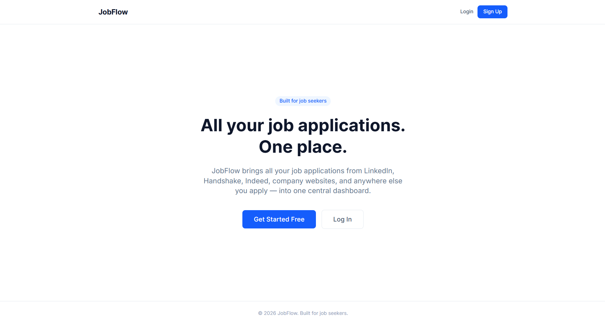
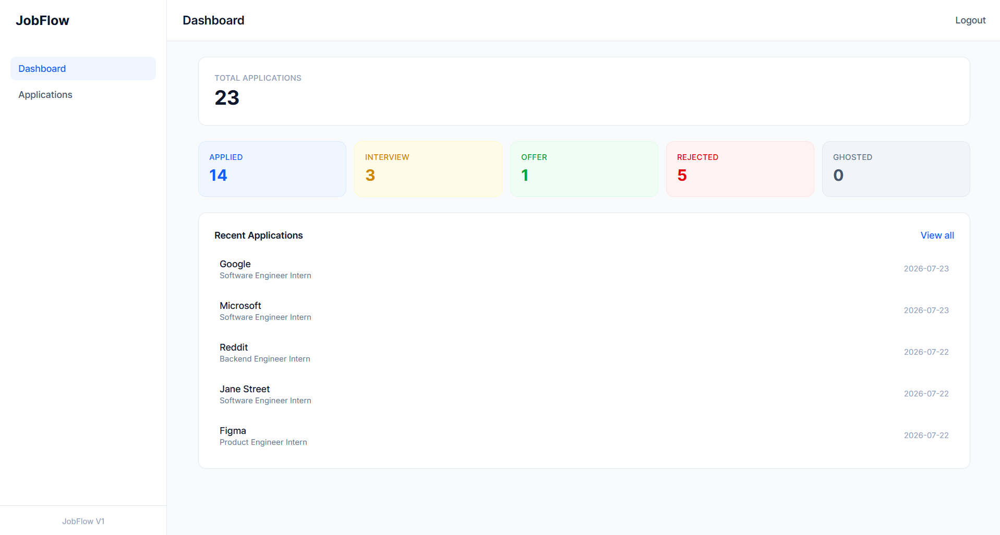
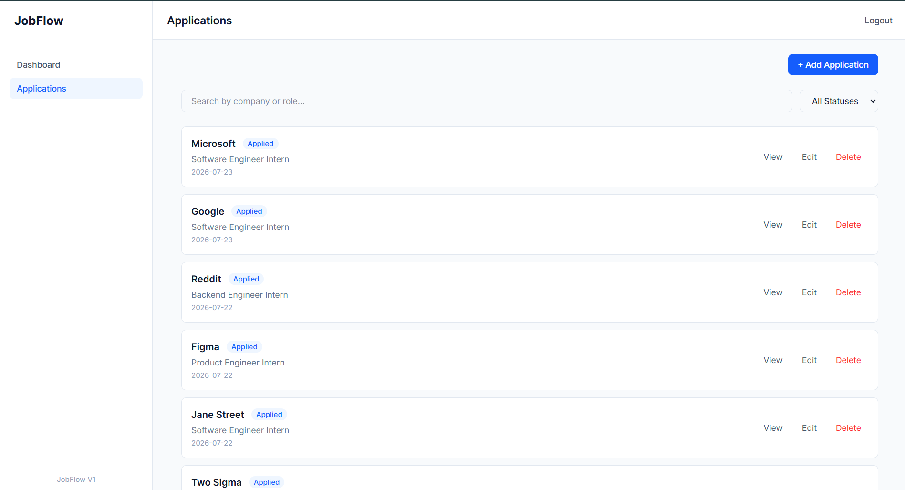
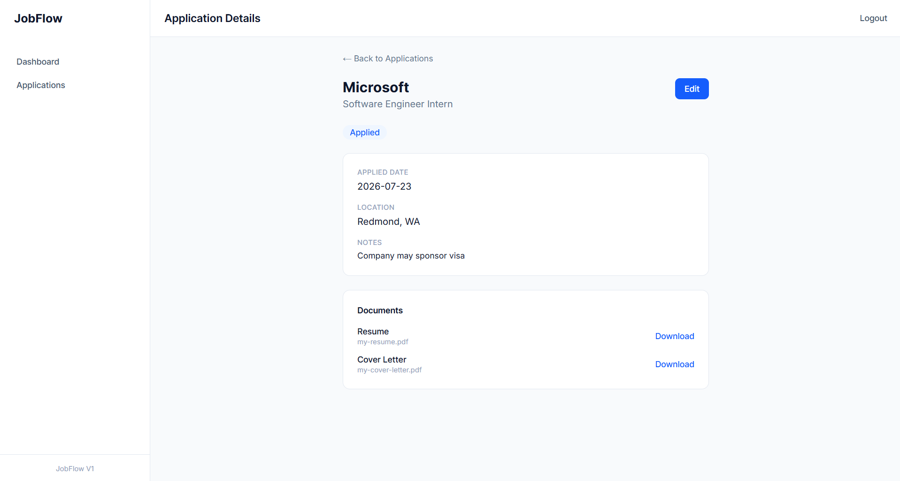
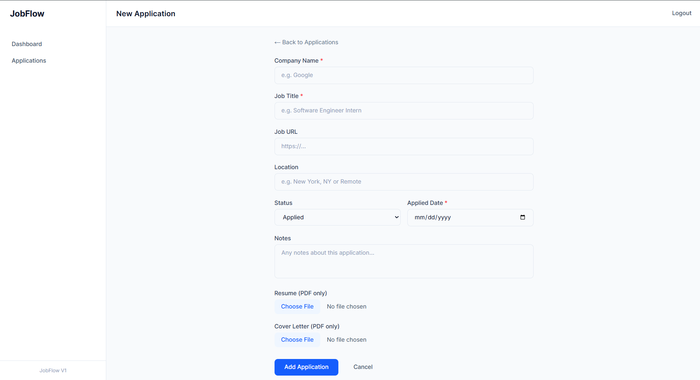

# JobFlow

A full-stack web app that helps job seekers track all their job applications — across every platform — in one place.

**Live app:** [myjobflow.dev](https://myjobflow.vercel.app)



---

## Why I Built This

I tailor my resume for each role I apply to, and kept losing track of which version I sent where. That became especially annoying when prepping for interviews — I wanted to review the exact resume the interviewer had in front of them, not my latest version.

JobFlow lets me attach the exact resume (and cover letter) to each application, along with status and notes, so I always know exactly what I submitted.

---

## Features

- **Email/password authentication** with verified signup
- **Full CRUD** on job applications — create, view, edit, delete
- **Per-application file storage** — upload and retrieve the exact resume and cover letter you sent for each specific application
- **Search and filter** applications by company, role, or status
- **Dashboard** with live stats — total applications, status breakdown, recent activity
- **Secure file downloads** via time-limited signed URLs (private storage, not publicly accessible)
- **Status tracking** — Applied, Interview, Offer, Rejected, Ghosted

---

## Screenshots

### Dashboard
Live stats computed from real application data — total count, status breakdown, and recent applications.



### Applications List
Search and filter across all applications.



### Application Detail
The core feature — the exact resume and cover letter sent for this specific application, downloadable anytime.



### Add Application
Simple form with file upload for resume and cover letter.



---

## Tech Stack

- **Frontend:** Next.js 16 (App Router), React, Tailwind CSS
- **Backend:** Next.js API Routes
- **Database:** Supabase (PostgreSQL)
- **Auth:** Supabase Auth
- **File Storage:** Supabase Storage (private bucket, signed URLs)
- **Deployment:** Vercel

---

## How It Works

- Row Level Security (RLS) policies ensure every user can only ever access their own applications and files — enforced at the database level, not just in application code
- Resume and cover letter files are stored in a private Supabase Storage bucket, organized by `{user_id}/{application_id}/`
- Files are never publicly accessible — every download goes through a signed URL that expires after 60 seconds
- A PostgreSQL trigger automatically updates each application's `updated_at` timestamp on every edit

---

## Getting Started Locally

### Prerequisites
- Node.js 18+
- A Supabase account

### Installation

1. Clone the repository
```bash
git clone https://github.com/JaydenAkpalu/jobflow.git
cd jobflow
```

2. Install dependencies
```bash
npm install
```

3. Set up environment variables

Create a `.env.local` file in the root of the project:
```
NEXT_PUBLIC_SUPABASE_URL=your_supabase_url
NEXT_PUBLIC_SUPABASE_PUBLISHABLE_KEY=your_supabase_publishable_key
```

4. Set up the database

Run the SQL in `supabase/migrations/001_initial_schema.sql`, then `supabase/migrations/002_add_updated_at_trigger.sql`, in your Supabase SQL editor, in that order.

5. Run the development server
```bash
npm run dev
```

Open [http://localhost:3000](http://localhost:3000) to see the app.

---

## Project Structure

```
jobflow/
├── app/
│   ├── (auth)/           # Login and signup pages
│   ├── (dashboard)/      # Protected dashboard, applications pages
│   └── api/               # API routes (applications, dashboard stats)
├── components/
│   └── applications/      # Shared ApplicationForm component
├── lib/
│   └── supabase/          # Supabase client setup (browser + server)
├── supabase/
│   └── migrations/        # Database schema and triggers
└── screenshots/           # README images
```